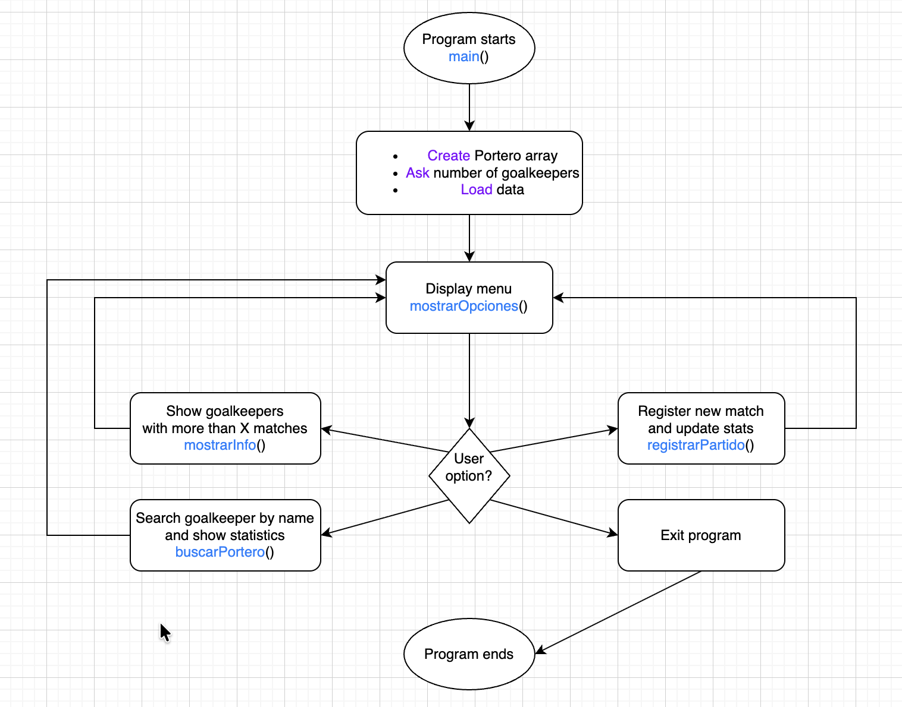

# Goalkeepers Management System

---

## Project Description

The project consists of the definition of a `Portero` class and several required methods, allowing the user to create objects and execute their corresponding behaviors.

As you may have guessed, this project was originally part of the final exam for my 5-week course “Object Oriented Computational Thinking” during my first semester of college. At the time, I honestly thought the exam would be something fairly chill—maybe just defining a class and implementing a few methods.

To my surprise, all of that was already given by the exam itself. The real challenge turned out to be working with arrays of objects, iterating over them using loops, and performing element-by-element comparisons based on user input.

The frustration of not fully understanding those topics stayed with me. During the last couple of days of my vacation—after finishing my other two projects, _Exploratory Data Analysis of Student Performance_ and _Airplanes OpenSky Project_, I reached out to my professor and asked him for the original exam instructions from that rather fateful day. I wanted to genuinely understand everything I was supposed to know to solve it.

This project is the result of that decision to not stay clueless. Even though this is an introductory OOP exercise and just a final exam, I believe it deserves a place in my repository. I see programming languages as tools in a carpenter’s toolbox: at this stage, practicing R, Python, or C++ is less about mastery and more about getting comfortable with the tools, learning how they feel in my hands, and starting to decide which future projects can be best handled with each one.

---

## Objective
The main objectives of this project are:

- Create the `Portero` class with the attributes and methods required by the problem.
- Implement a function that loads `Portero` objects into an array by asking the user for the necessary information, ensuring that the total number of objects does not exceed 10.
- Implement a function that displays only the goalkeepers who have played more than X number of matches, where X is provided by the user.
- Implement a function that displays the basic information of a selected goalkeeper, including their average saves per game, based on the name entered by the user.
- Implement a function that registers a new match for a specific goalkeeper by asking the user for the number of saves made and updating the object’s stored data accordingly.
- Implement a menu-driven function that presents the available options to the user and executes the corresponding functionality based on the selected option.
- As a personal extension, include comprehensive user input validation throughout the program to make it as robust and error-resistant as possible.

---

## Project structure
```bash
├── gestion-porteros-c++/
│   ├── Portero.h # Class definition for the Portero (goalkeeper) object
│   ├── Portero.cpp # Implementation of the Portero class methods
│   ├── main.cpp # Program entry point and menu-driven logic
│   └──images/  # Contains the flowchart used in the README
│      └── program_flow.png
└────── README.md # Project documentation

```

---

## General Script Workflow
The following flowchart summarizes the general execution logic of the program:



---

## Code explanation

### 1. Defining the number of goalkeepers

Function: `cantidadPorteros()`

   - Asks the user how many goalkeepers will be stored
   - Restricts the value to a range between 1 and 10
   - Ensures that the program never exceeds the array limits
   - Exists to keep main() clean and focused only on orchestration

### 2. Loading goalkeeper data

Function: `cargarDatos()`

  - Iterates over the array based on the validated size
  - Requests name, matches played, and saves for each goalkeeper
  - Uses setter methods to encapsulate attribute assignment
  - Performs basic input validation before storing the data

### 3. Filtering and displaying information

Function: `mostrarInfo()`

  - Requests a minimum number of matches to consider
  - Iterates through the array and filters goalkeepers accordingly
  - Displays only those who meet the required condition
  - Helps demonstrate conditional logic and array traversal

### 4. Searching for a goalkeeper

Function: `buscarPortero()`

  - Asks the user for a goalkeeper name
  - Performs a linear search through the array
  - Displays detailed statistics, including saves per match
  - Handles the case where the goalkeeper is not found

### 5. Registering a new match

Function: `registrarPartido()`

  - Allows updating a goalkeeper’s statistics after a new match
  - Increments matches played and adds new saves
  - Demonstrates object state modification through class methods

### 6. Menu control and program loop

Function: `mostrarOpciones()`

  - Displays the main menu options
  - Routes execution based on user input
  - Repeats until the user chooses to exit the program
  - Acts as the central control flow of the application

---

## Object Oriented design
This project is based on Object Oriented Programming (OOP) principles, and for that reason, I decided to document its design properly, because understanding why things are built a certain way is just as important as making them work.

### The `Portero` class
The core of the project is the Portero class, which represents a goalkeeper and encapsulates all the information and behavior related to him.
Each object created from this class models a real goalkeeper, storing his data and allowing controlled interaction with it through methods.

### Private attributes
All attributes inside the Portero class are declared as private. 
These include data such as the goalkeeper’s name, number of games played, total saves, and any other relevant statistics.

Making attributes private prevents them from being modified directly from outside the class, which helps avoid inconsistent or invalid states in the object.

### Constructors
The class includes both a default constructor and a parameterized constructor, allowing Portero objects to be created either empty or with valid initial values.
This guarantees that every goalkeeper object is created in a usable and coherent state from the very beginning, instead of relying on later manual assignments.

### Getters and setters
To access or modify the private attributes, the class provides getter and setter methods.

- **Getters** allow reading attribute values safely.

- **Setters** allow updating values while keeping control over how and when those changes occur.

### Extra methods
The class includes additional methods that represent actions or calculations related to a goalkeeper, such as:

  - Updating statistics after a game
  - Calculating saves per game
  - Displaying formatted information

---

### Tools Used

**C++ and Xcode**

  - Object-Oriented Programming
  - Input/output handling
  - Arrays of objects

---

### How to Test This Program on Your Own Computer
1. You only need a standard C++ compiler that supports C++11 or later.
2. Clone this repository
  ```bash
  git clone <https://github.com/EnriqueAndal/gestion-porteros-c->
  cd gestion-porteros-cpp
  ```
3. Compile the program by running this command on the terminal you are using:
  ```bash
  g++ main.cpp Portero.cpp -o gestion_porteros
  ```
4. Run the compiled executable
  ```bash
  ./gestion_porteros
  ```
5. Follow the on-screen menu instructions to interact with the program.
